# EN.525.615 Laboratory 02
Dave Jansing  
Spring 2022

NOTE:  You will be responsible for writing a lab report for this laboratory.  You will modify the `lab_report.md` file in the `report` directory in your repository, putting any images, etc into the `media` directory.  Markdown cheat sheets can be found in the `supporting` directory.

- [EN.525.615 Laboratory 02](#en525615-laboratory-02)
  - [Experiment 1:  C Programming Examples](#experiment-1--c-programming-examples)
    - [Project Setup](#project-setup)
    - [example_v0](#example_v0)
    - [example_v1](#example_v1)
    - [example_v2](#example_v2)
    - [example_v3](#example_v3)
    - [example_v4](#example_v4)
    - [Notes](#notes)
  - [Experiment 2:  Programming Lab Exercises](#experiment-2--programming-lab-exercises)
    - [Project Setup](#project-setup-1)
    - [Exercise 1](#exercise-1)
    - [Exercise 2](#exercise-2)
    - [Exercise 3](#exercise-3)
    - [Exercise 4](#exercise-4)
    - [Exercise 5](#exercise-5)
    - [Exercise 6](#exercise-6)
      - [Exercise 6.1](#exercise-61)
      - [Exercise 6.2](#exercise-62)
      - [Exercise 6.3](#exercise-63)
    - [Exercise 7](#exercise-7)
    - [Exercise 8](#exercise-8)
      - [Exercise 8.1](#exercise-81)
      - [Exercise 8.2](#exercise-82)
      - [Exercise 8.3](#exercise-83)
      - [Exercise 8.4](#exercise-84)
    - [Exercise 9](#exercise-9)

## Experiment 1:  C Programming Examples

In this experiment we will walk through a few different programming examples to help fresh your memory in C/C++ programming.

We will work through five different examples that all have the same basic function prototypes.


```
void do_example_v0(int startIndex, int stopIndex);
void do_example_v1(int startIndex, int stopIndex);
void do_example_v2(int startIndex, int stopIndex);
void do_example_v3(int startIndex, int stopIndex);
void do_example_v4(int startIndex, int stopIndex);
```

Each example with have slightly different requirements to help review a few different C/C++ programming concepts.

### Project Setup

- Go to claim your repository in GitHub classroom.
- Create a new C/C++ Project named `examples` in your workspace.
- Apply the knowledge you learned in the `Hello World Tutorial` above to complete this step.

Your workspace should now look similar to the image below.

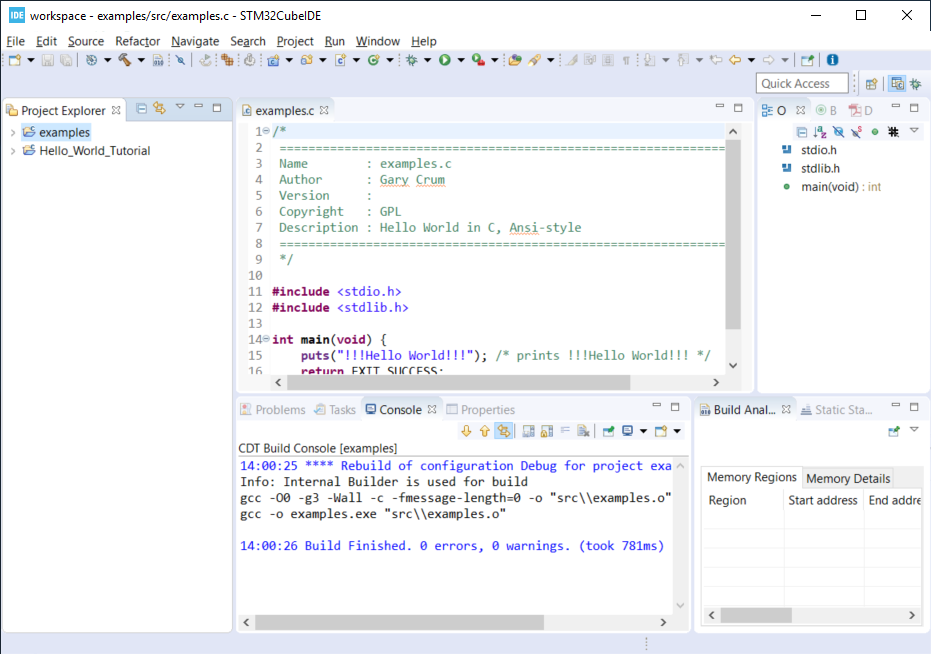

**Create a Debug Configuration Execute the Application with the Debugger**

Apply the knowledge you learned in the `Hello World Tutorial` above to complete this step.

**Update C Includes**

Update the `examples.c` file to include a few more c standard library functions:

```
#include <stdio.h>       //for printf
#include <stdlib.h>      //srand,rand
#include <string.h>      //for memcpy/strcpy
#include <unistd.h>      //for sleep
#include <time.h>        //for clock
```

**Eclipse Print Buffer Fix**

By default the Eclipse IDE buffers Standard Out (stdout) and Standard Error (stderr) file descriptors.

To help with getting the print message when `printf` is called we disable this buffering.

In the `examples.c` file add the following line below the `includes` section.

```
#define ECLIPSE_FLUSH_FIX (1)  //Conditionally Disable Buffering print messages
```

At the beginning of the `main` function in `example.c` add the following lines:

```
#if ECLIPSE_FLUSH_FIX == (1)
    //WARNING: This doesn't like it if you don't have a new line (ie \n)
    setvbuf(stdout, NULL, _IONBF, 0);
    setvbuf(stderr, NULL, _IONBF, 0);
#endif
```

Your `examples.c` file should now look similar to the image below.

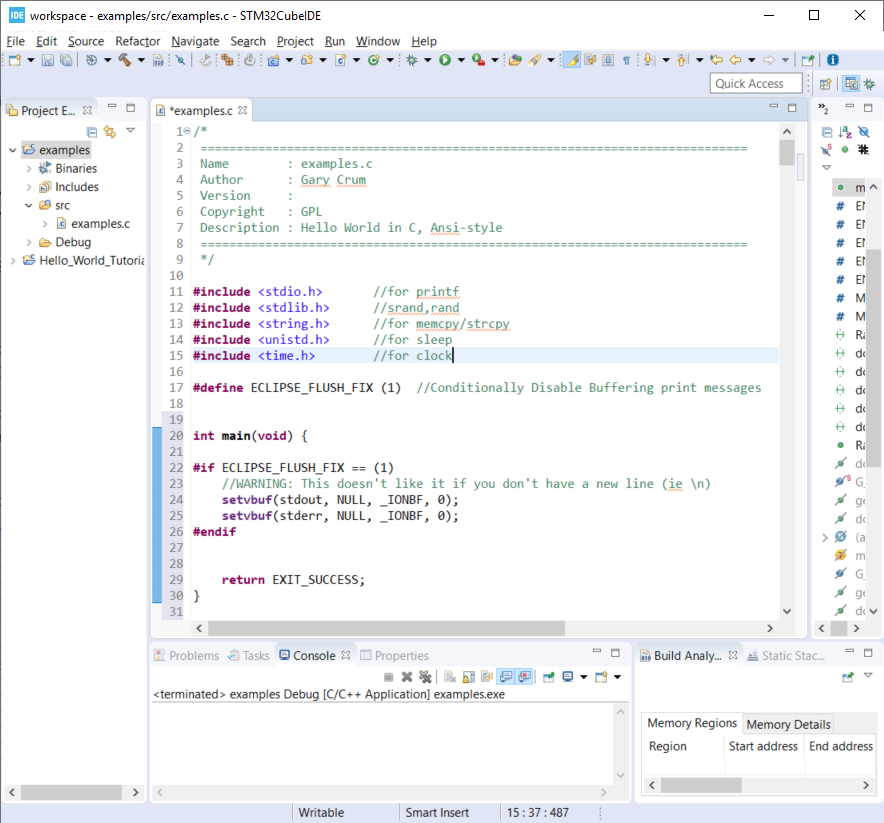

**Randomly seed startIndex and stopIndex**

To help with testing we will randomly seed the start and stop indexes.

Add the following function prototype to `examples.c`:

```
/**** Function Prototypes ****/

/**
 *  Returns a random number between Lowest and Highest values (inclusive)
 */
int RandomInt(int Lowest, int Highest);
```

Add the following function defition to `examples.c`:

```
/**** Function Definitions ****/

int RandomInt(int Lowest, int Highest)
{
    srand(clock());
    return (rand() % (Highest-Lowest) + Lowest);
}
```

Inside `main` of `examples.c` add the following lines of code.

```
   //Setup
   int startIndex = 0;
   int stopIndex  = 0;

   startIndex = RandomInt(0, 20);                //used as the seed for the functions
   stopIndex  = startIndex + RandomInt(1,5);     //end index for testing
   printf("startIndex = %d, stopIndex = %d", startIndex, stopIndex);
```

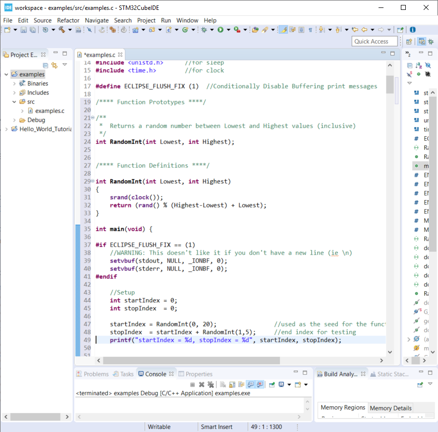

**Add Conditional Include Definitions**

To help enabling and disable individual versions of the examples we will wrap the call and source code finside `#if / #endif` blocks.

This will allow us to disable large parts of code while debugging or working on other parts of the code.

Add the following lines of code to `examples.c`:

```
//Conditionally include example source code
#define ENABLE_EXAMPLE_V0 (1)
#define ENABLE_EXAMPLE_V1 (0)
#define ENABLE_EXAMPLE_V2 (0)
#define ENABLE_EXAMPLE_V3 (0)
#define ENABLE_EXAMPLE_V4 (0)
```

Add the following function prototypes.

```
//Prototype for Example Functions
void do_example_v0(int startIndex, int stopIndex);
void do_example_v1(int startIndex, int stopIndex);
void do_example_v2(int startIndex, int stopIndex);
void do_example_v3(int startIndex, int stopIndex);
void do_example_v4(int startIndex, int stopIndex);
```

The top of your examples.c file should look similar to the image below.

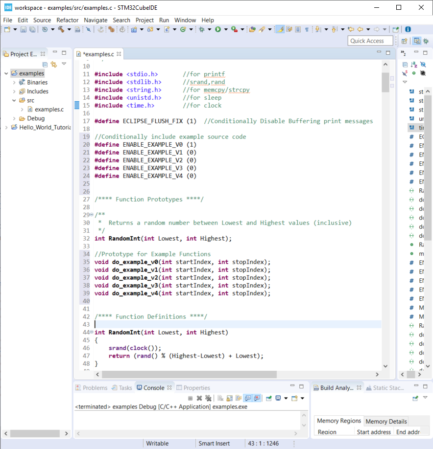

**Add Calls to Example Functions**

Inside the `main` function, add the following:


```
    while (1)
    {

        #if ENABLE_EXAMPLE_V0 == (1)
                printf("\nExample v0\n\r");
                do_example_v0(startIndex, stopIndex);
        #endif

        #if ENABLE_EXAMPLE_V1 == (1)
                printf("\nExample v1\n\r");
                do_example_v1(startIndex, stopIndex);
        #endif

        #if ENABLE_EXAMPLE_V2 == (1)
                printf("\nExample v2\n\r");
                do_example_v2(startIndex, stopIndex);
        #endif

        #if ENABLE_EXAMPLE_V3 == (1)
                printf("\nExample v3\n\r");
                do_example_v3(startIndex, stopIndex);
        #endif

        #if ENABLE_EXAMPLE_V4 == (1)
                printf("\nExample v4\n\r");
                do_example_v4(startIndex, stopIndex);
        #endif

                //throttle this down some for human debug
                sleep(1);
    }
```

Your `main` function should now look similar to the image below.

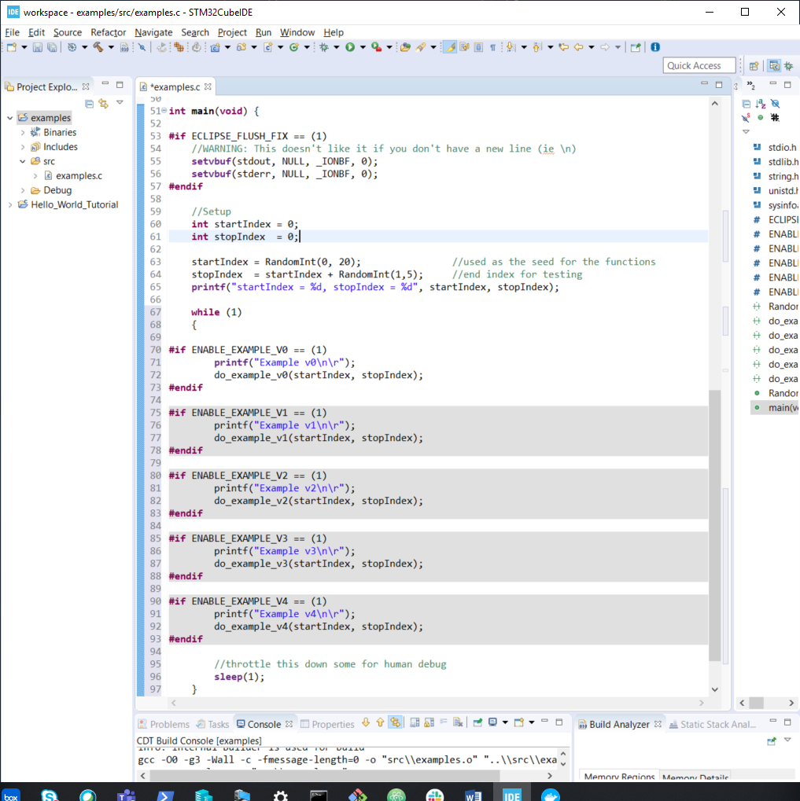

**Commit Your Code**

Now is a great time to commit your code and push it to GitHub.

### example_v0

For this example we are simply going to loop from the startIndex to the endIndex and print 'Hello World' in each loop.

Below the `RandomInt` function definition, add the following code block:

```
#if ENABLE_EXAMPLE_V0 == (1)
//Example V0 Source Code

/**
 * @brief Main entry point for Version 0 of our Example v0
 *
 * Loops from startIndex and stopIndex and prints "Hello World"
 *
 * @param startIndex
 * @param stopIndex
 * @return void
 *
 */
void do_example_v0(int startIndex, int stopIndex){
    while(startIndex <= stopIndex){
        printf("Hello World\n");
        startIndex++;
    }
    return;
}
#endif
```

**Execute the Application with the Debugger**

In the Eclipse console for this run I have a startIndex of 5 and stopIndex of 7.  We then see the loop printing `Hello World` three times and repeating.

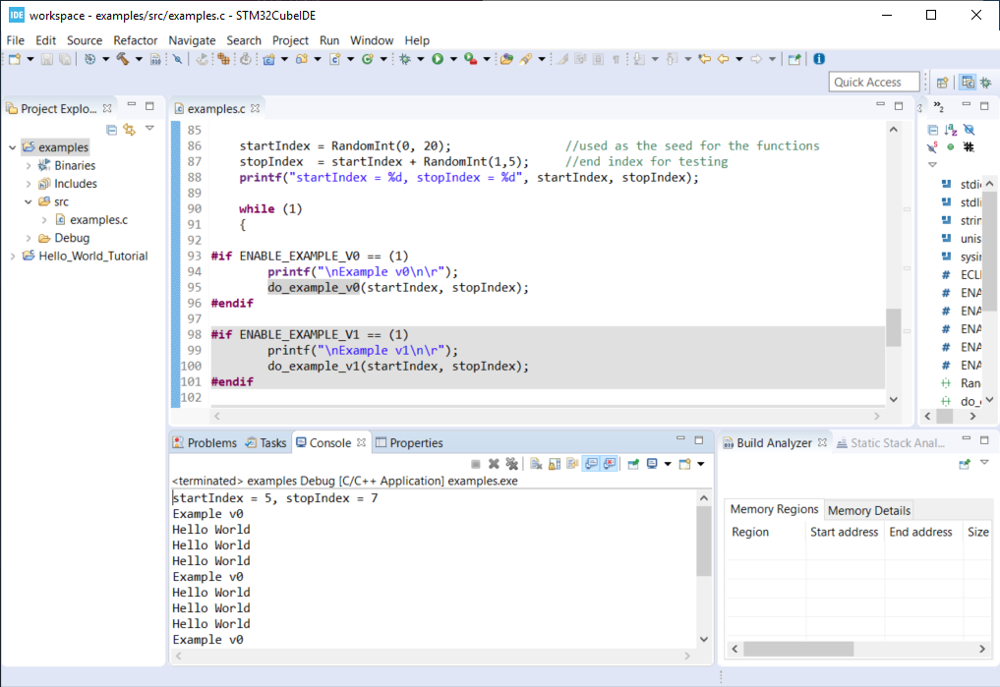

**Commit Your Code**

Now is a great time to commit your code and push it to GitHub.

### example_v1

In this example we will define a two dimensional array to store our messages.  We will create a function that will takes an integer argument and returns the message at index 0 if it's even and index 1 if the argument is odd.  We then loop through from the startIndex to the stopIndex and print the returned message;

- Disable `ENABLE_EXAMPLE_V0` by changing the definition value to `0`
- Enable `ENABLE_EXAMPLE_V1` by changing the definition value to `1`

Under the `#if ENABLE_EXAMPLE_V4` definition add the following code block.
This code block will be used for more than one of the examples and is not conditionally included.

```
//Message Constraints
#define MAX_MESSAGES      ( 2)
#define MAX_MESSAGE_SIZE  (40)
```

Your code should look similar to the image below.

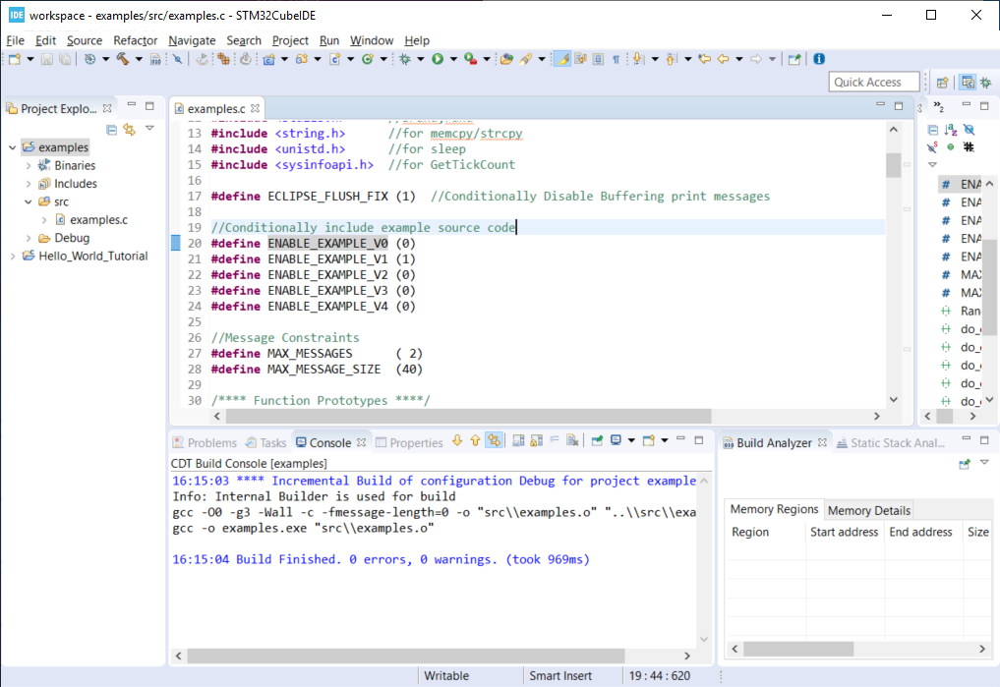

Add the following code block below the `ENABLE_EXAMPLE_V0` block:

```
#if ENABLE_EXAMPLE_V1 == (1)
//Example V1 Source Code

static char G_exampleStrings[MAX_MESSAGES][MAX_MESSAGE_SIZE] =
{
        "Hello World",
        "Hello Class"
}; /**< Global var to hold two strings */

/**
 * @brief Assigns exampleStringPtr to a global variable based on even/odd input value
 *
 * If `number` is even, then `exampleStringPtr` will be assigned to the string
 * at index 0 of the `G_exampleStrings` array
 *
 * If `number` is odd, then `exampleStringPtr` will be assigned to the string
 * at index 1 of the `G_exampleStrings` array
 *
 * @param int number - used to select which string to assign to exampleStringPtr
 * @param char **exampleStringPtr - pointer to a char*
 * @return void
 *
 */
void getExampleString_v1(int number, char **exampleStringPtr)
{
    if (number % 2 == 0){
        //even number
        *exampleStringPtr = G_exampleStrings[0]; //G_exampleStrings[0] is a pointer to a char* variable (a string in our case)
    }
    else{
        //odd number
        *exampleStringPtr = G_exampleStrings[1];
    }
    return;
}

/**
 * @brief Main entry point for Example v1
 *
 * Loops from startIndex and stopIndex calls getExampleString_v1 then prints a string
 *
 * This version stores multiple strings in a global multidimensional array
 *
 * @param startIndex
 * @param stopIndex
 * @return void
 *
 */
void do_example_v1(int startIndex, int stopIndex)
{
    char *exampleString = 0;
    int currentIndex;
    for(currentIndex = startIndex; currentIndex <= stopIndex; currentIndex++)
    {
        getExampleString_v1(currentIndex, &exampleString);
        printf("%s\n\r", exampleString);
    }

}
#endif
```
 
**Execute the Application with the Debugger**

In the Eclipse console for this run I have a startIndex of 7 and stopIndex of 11.
We then see the loop alternating printing `Hello World` and `Hello Class`.

Step through the code, set break point and explore the logic to make sure you understand how it works.

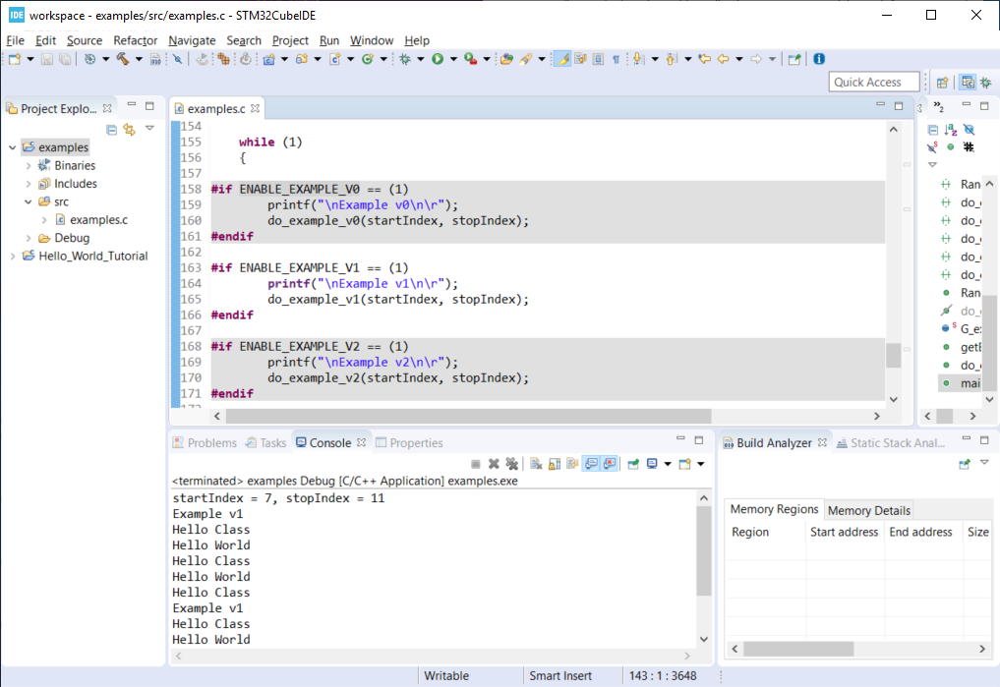

**Commit Your Code**

Now is a great time to commit your code and push it to GitHub.

### example_v2

In this example we will use a struct global variable to store our messages.
The struct will contain a two dimensional array to store our messages.
It will also contain the information about the size and number of messaage.
This is one step closer to making more portable code.

We will create a function that will takes an integer argument and returns the message at index 0 if it's even and index 1 if the argument is odd.
We then loop through from the startIndex to the stopIndex and print the returned message;

- Disable `ENABLE_EXAMPLE_V1` by changing the definition value to `0`
- Enable `ENABLE_EXAMPLE_V2` by changing the definition value to `1`

Below the `#if ENABLE_EXAMPLE_V1` section, add the following code bock.

```
#if ENABLE_EXAMPLE_V2 == (1)
//Example V2 Source Code


/**
 * @brief data structure to hold messages
 *
 * Contains information on the number of string and the max messages allowed
 */
typedef struct {
    int maxMessages;  /**< Max number of messages allowd. */
    int numMessages;  /**< number of messages in the data structure */
    char messages[MAX_MESSAGES][MAX_MESSAGE_SIZE]; /** < 2d array of strings */
}messages_v2_t;


messages_v2_t G_msgInst_v2 = {
        MAX_MESSAGES, // maxMessages
        2,            // numMessages
        {   //messages
                "Hello World",
                "Hello Class"
        }
}; /**< Global var for the messages data struct */


/**
 * @brief Assigns exampleStringPtr to a global variable based on even/odd input value
 *
 * If `number` is even, then `exampleStringPtr` will be assigned to the string
 * at index 0 of the `G_msgInst_v2.messages` array
 *
 * If `number` is odd, then `exampleStringPtr` will be assigned to the string
 * at index 1 of the `G_msgInst_v2.messages` array
 *
 * @param int number - used to select which string to assign to exampleStringPtr
 * @param char **exampleStringPtr - pointer to a char*
 * @return void
 *
 */
char* getExampleString_v2(int number, char **exampleStringPtr)
{
    if (number % 2 == 0){
        //even number
        *exampleStringPtr = G_msgInst_v2.messages[0];

    }
    else{
        //odd number
        *exampleStringPtr = G_msgInst_v2.messages[1];
    }
    return *exampleStringPtr;
}

/**
 * @brief Main entry point for Example v2
 *
 * Loops from startIndex and stopIndex calls getExampleString_v2 then prints a string
 *
 * This version stores multiple strings in a global array of a structure
 *
 * @param startIndex
 * @param stopIndex
 * @return void
 *
 */
void do_example_v2(int startIndex, int stopIndex)
{
    int currentIndex;
    for(currentIndex = startIndex; currentIndex <= stopIndex; currentIndex++)
    {
        char *exampleString1 = 0;
        exampleString1 = getExampleString_v2(currentIndex, &exampleString1);
        printf("%s\n\r", exampleString1);
    }

}
#endif
```

**Execute the Application with the Debugger**

In the Eclipse console for this run I have a startIndex of 1 and stopIndex of 3.
We then see the loop alternating printing `Hello World` and `Hello Class`.

Step through the code, set break point and explore the logic to make sure you understand how it works.

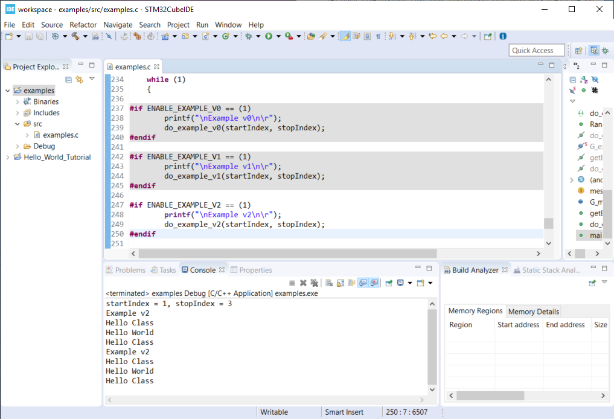

**Commit Your Code**

Now is a great time to commit your code and push it to GitHub.

### example_v3

In this example we will move away from using a global variable.
We will not define a struct variable locally and pass it to the function to be used.
This is a good example for making portable and reusable code.

We will create a function that will takes an integer argument and returns the message at index 0 if it's even and index 1 if the argument is odd.
We then loop through from the startIndex to the stopIndex and print the returned message;


- Disable `ENABLE_EXAMPLE_V2` by changing the definition value to `0`
- Enable `ENABLE_EXAMPLE_V3` by changing the definition value to `1`

Below the `#if ENABLE_EXAMPLE_V2` section, add the following code bock.


```
#if ENABLE_EXAMPLE_V3 == (1)
//Example V3 Source Code

/**
 * @brief data structure to hold messages
 *
 * Contains information on the number of string and the max messages allowed
 */
typedef struct {
    int maxMessages;  /**< Max number of messages allowd. */
    int numMessages;  /**< number of messages in the data structure */
    char messages[MAX_MESSAGES][MAX_MESSAGE_SIZE]; /** < 2d array of strings */
}messages_v3_t;


/**
 * @brief Assigns exampleStringPtr to a global variable based on even/odd input value
 *
 * If `number` is even, then `exampleStringPtr` will be assigned to the string
 * at index 0 of the `msgInst->messages` array
 *
 * If `number` is odd, then `exampleStringPtr` will be assigned to the string
 * at index 1 of the `msgInst->messages` array
 *
 * @param messages_v3_t  *msgInst - pointer to struct containing messages
 * @param int number - used to select which string to assign to exampleStringPtr
 * @param char **exampleStringPtr - pointer to a char*
 * @return void
 *
 */
void getExampleString_v3(messages_v3_t *msgInst, int number, char **exampleStringPtr)
{
    if (number % 2 == 0){
        //even number
        *exampleStringPtr = msgInst->messages[0];
    }
    else{
        //odd number
        *exampleStringPtr = msgInst->messages[1];
    }
    return;
}

/**
 * @brief Main entry point for Example v2
 *
 * Declares local variable of type messages_v3_t to store messages.
 * Passed this variable to getExampleString_v3 when called.
 * Loops from startIndex and stopIndex calls getExampleString_v3 then prints a string
 *
 * @param startIndex
 * @param stopIndex
 * @return void
 *
 */
void do_example_v3(int startIndex, int stopIndex)
{

    messages_v3_t msgInst = {
            1, // maxMessages
            2, // numMessages
            {  //messages
                    "Hello World",
                    "Hello Class"
            }
    }; //local variable to contain messages

    int currentIndex;
    for(currentIndex = startIndex; currentIndex <= stopIndex; currentIndex++)
    {
        char *exampleString1 = 0;
        getExampleString_v3(&msgInst, currentIndex, &exampleString1); //pass pointer of msgInst
        printf("%s\n\r", exampleString1);
    }

}
#endif
```

**Execute the Application with the Debugger**

In the Eclipse console for this run I have a startIndex of 2 and stopIndex of 5.
We then see the loop alternating printing `Hello World` and `Hello Class`.

Step through the code, set break point and explore the logic to make sure you understand how it works.


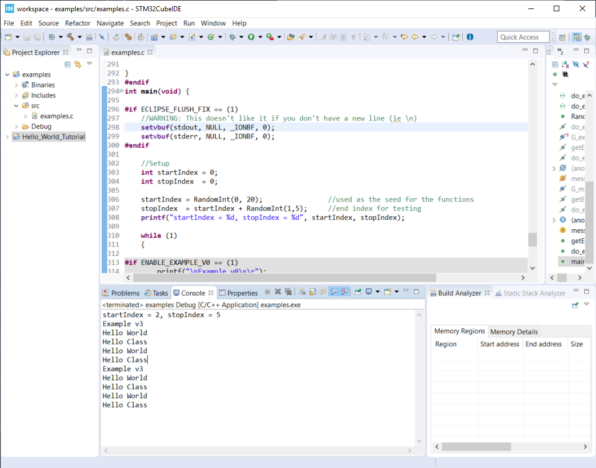


**Commit Your Code**

Now is a great time to commit your code and push it to GitHub.

### example_v4

This example completes the journal to making more object oriented code in C.
We create an init function to allocate the memory used to store the messages.
We also create a helper function to add messages to our structures.

We define two variables of the same type to demonstrate reusability of the structure for different needs.

- Disable `ENABLE_EXAMPLE_V3` by changing the definition value to `0`
- Enable `ENABLE_EXAMPLE_V4` by changing the definition value to `1`


Below the `#if ENABLE_EXAMPLE_V3` section, add the following code bock:

```
#if ENABLE_EXAMPLE_V4 == (1)
//Example V4 Source Code

/**
 * @brief data structure to hold messages
 *
 * Contains information on the number of strings, the max messages allowed and max size of message
 */
typedef struct {
    int maxMessages;    /**< Max number of messages allowed. */
    int maxMessageSize; /**< Max size of message */
    int numMessages;    /**< number of messages in the data structure */
    char **messages;    /**< pointer of pointers (ie dynamic 2d array) */
}messages_v4_t;

/**
 * @brief Initialize messages_v4_t variable
 *
 * Allocate memory for the dynamic 2d array
 * @param messages_v4_t  *msgInst - pointer to struct containing messages
 * @param maxMessages - number of messages we can hold
 * @param maxMessageSize - max size of a message
 * @return status = 0 failed, 1 success
 */
int init_messages_v4(messages_v4_t* msgInst, int maxMessages, int maxMessageSize){
    int status = 1;//assume we are good

    msgInst->maxMessages    = maxMessages;
    msgInst->maxMessageSize = maxMessageSize;
    msgInst->numMessages    = 0;

    //References for allocating
    //https://web.archive.org/web/20170831232159/https://www.techiedelight.com/dynamically-allocate-memory-for-2d-array/
    //https://www.geeksforgeeks.org/dynamically-allocate-2d-array-c/

    //allocate memory for pointers to other areas - this is number of messages
    msgInst->messages = (char**)malloc(maxMessages*sizeof(char*));

    //loop through and create an areas for the message.  The above pointers will point to this memory
    for(int msgIndex = 0; msgIndex < maxMessages; msgIndex++){
        msgInst->messages[msgIndex] = (char*)malloc(maxMessageSize*sizeof(char));

        if(msgInst->messages == NULL){
            status = 0;
            break;
        }
    }

    return status;
}

/**
 * @brief Adds a message to a messages_v4_t type variable
 * Increments the number of messages stored internally
 *
 * @param messages_v4_t  *msgInst - pointer to struct containing messages
 * @param message - char array for the message to store
 * @return status = 0 failed, 1 success
 */
int addMessage_v4(messages_v4_t * msgInst, const char * message){
    int status = 0;

    if (msgInst->numMessages < msgInst->maxMessages){
    	status = 1; //we have enough room.. set status to ok

    	//copy the message over.
        strncpy(msgInst->messages[msgInst->numMessages], message, msgInst->maxMessageSize);

        msgInst->numMessages++;  //increment the count for number of messages stored
    }
    return status;
}


/**
 * @brief Assigns exampleStringPtr to a global variable based on even/odd input value
 *
 * If `number` is even, then `exampleStringPtr` will be assigned to the string
 * at index 0 of the `msgInst->messages` array
 *
 * If `number` is odd, then `exampleStringPtr` will be assigned to the string
 * at index 1 of the `msgInst->messages` array
 *
 * @param messages_v3_t  *msgInst - pointer to struct containing messages
 * @param int number - used to select which string to assign to exampleStringPtr
 * @param char **exampleStringPtr - pointer to a char*
 * @return void
 *
 */
int getExampleString_v4(messages_v4_t *msgInst, int number, char **exampleStringPtr)
{
    int status = 0;
    if (number % 2 == 0)
    {
        //even number
        *exampleStringPtr = msgInst->messages[0];
    }
    else
    {
        //odd number
        *exampleStringPtr = msgInst->messages[1];
    }

    return status;
}


/**
 * @brief Main entry point for Example v3
 *
 * Declares two local variable of type messages_v4_t to store messages.
 * Passes the two different variables to getExampleString_v4 when called.
 * Loops from startIndex and stopIndex calls getExampleString_v4 then prints a string
 *
 * @param startIndex
 * @param stopIndex
 * @return void
 *
 */
void do_example_v4(int startIndex, int stopIndex)
{
    int currentIndex;
    messages_v4_t msgInst_daytime;
    messages_v4_t msgInst_nighttime;

    int status = 0;
    status = init_messages_v4(&msgInst_daytime, MAX_MESSAGES,  MAX_MESSAGE_SIZE);
    if(status == 0){
        return;//fail silently for this example
    }

    status = init_messages_v4(&msgInst_nighttime, MAX_MESSAGES,  MAX_MESSAGE_SIZE);
    if(status == 0){
        return;//fail silently for this example
    }

    status = addMessage_v4(&msgInst_daytime, "Hello Day Time World");
    if(status == 0){
            return;//fail silently for this example
    }

    status = addMessage_v4(&msgInst_daytime, "Hello Day Time Class\0");
    if(status == 0){
            return;//fail silently for this example
    }

    status = addMessage_v4(&msgInst_nighttime, "Hello Night Time World\0");
    if(status == 0){
            return;//fail silently for this example
    }

    status = addMessage_v4(&msgInst_nighttime, "Hello Night Time Class\0");

    if(status == 0){
            return;//fail silently for this example
    }
    printf("\n\n\rmsgInst_daytime %d\n\n\r", msgInst_daytime.numMessages);

    for(currentIndex = startIndex; currentIndex <= stopIndex; currentIndex++)
    {
        char *exampleString1 = 0;
        char *exampleString2 = 0;

        //process with msgInst_daytime
        status = getExampleString_v4(&msgInst_daytime, currentIndex, &exampleString1);
        printf("%s\n\r", exampleString1);

        //process with msgInst_nighttime
        status = getExampleString_v4(&msgInst_nighttime, currentIndex, &exampleString2);
        printf("%s\n\r", exampleString2);
    }

}
#endif
```

**Execute the Application with the Debugger**

In the Eclipse console for this run I have a startIndex of 18 and stopIndex of 19.
We then see the loop alternating printing `Hello Day Time World` and `Hello Day Time Class` for the first stucture instance.
We also see the loop alternating printing `Hello Night Time World` and `Hello Night Time Class` from the section structure instance.

Step through the code, set break point and explore the logic to make sure you understand how it works.

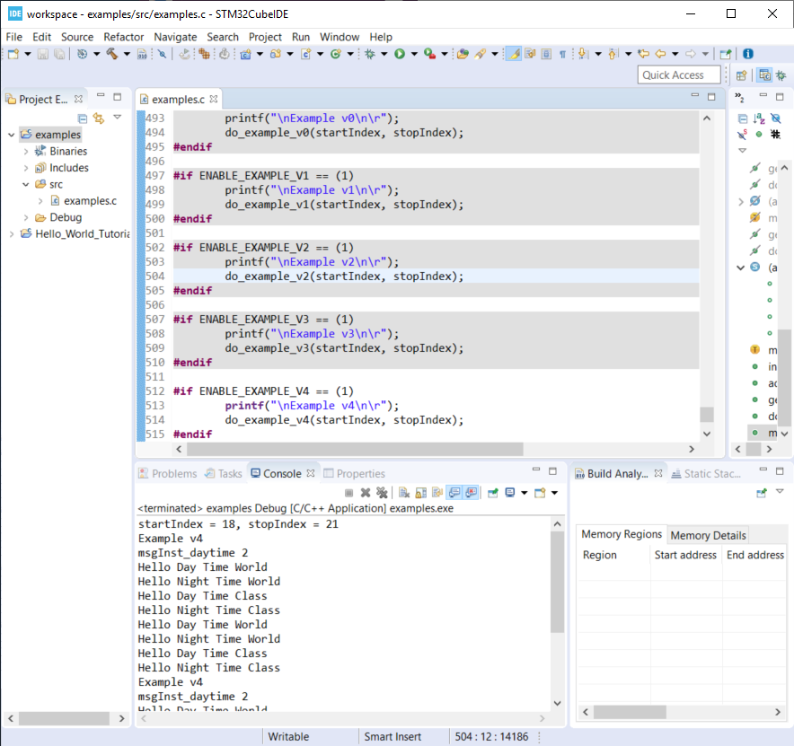

**Commit Your Code**

Now is a great time to commit your code and push it to GitHub.

### Notes

- The examples.c file is getting rather long
  - In practice I would have created a new file for each example
- When doing dynamic memory allocation, you should do it at the beginning
  - You wouldn't want to attempt to allocate more memory later and have an embedded system crash with no more memory
  - Consider staticly allocating memory for very memory limited applications such as microcontrollers
- You should consider when it is ok to fail silently
  - In the example above we failed silently, however in practice if you can't initialize the system you should trigger some error condition
- There are a few places where we used `Magic Numbers` (e.g. hardcoded 2 for number of messages); you should avoid this for your lab work

## Experiment 2:  Programming Lab Exercises

In this experiment there are programming exercises that will need to complete.
The topics cover important general programming patterns that you should already be familair with.

TIP: Please remember to commit your code after major updates.

### Project Setup

In the same workspace as the `Hello_World_Tutorial` create a new C/C++ Project named `exercises`

Apply the knowledge you learned in the `Hello World Tutorial` and  above to complete this step.

**Create a Debug Configuration Execute the Application with the Debugger**

Apply the knowledge you learned in the `Hello World Tutorial` above to complete this step.

- Create a new file for each exercies (e.g. ex1.c, ex2.c, ex9.c)
- The function prototype for the entry of each exercies shall take no arguments and return void. e.g.:
  -- `void ex1(void);`
  -- `void ex2(void);`

If you have common helper functions used across multiple exercises then consider placing it in `utils.c` and `utils.h` files.

### Exercise 1

[Array, ForLoop]

Write a C function or functions that will take an array of `chars`
and reverse the order of the elements in the array.

Print out the source array and then the reversed array.

Include unit test to validate the algorithm and check corner cases.

Tip: To support unit testing we should have at least two functions.
One to reverse to the `chars` and one to print the result.

Example Input and Output:

```
char test1[] = { '0','1','2','3','4','5','6','7','8','9'};
char test2[] = { 'A','B','C','D','E','F','G','H','I'};
```

Output:

```
Exercise 1 - Case 1
0 1 2 3 4 5 6 7 8 9
9 8 7 6 5 4 3 2 1 0

Exercise 1 - Case 2
A B C D E F G H I
I H G F E D C B A
```

### Exercise 2

[Math/Float, Basic Algorithm]

Write a C function or functions that will take the radius of a circle and return
the area of the circle.
Use single precision floating point calculations.
Print the radius and the calculated area to seven significant digits of accuracy to the terminal.

Include unit test to validate the algorithm and check corner cases.

Example Output:

```
Exercise 2 - Case 1
Radius 1.000000, Area 3.141593

Exercise 2 - Case 2
Radius 2.245000, Area 15.83371
```

TIP: Checkout this great article about embedded systems and floating point numbers [here](https://embedded.fm/blog/2016/4/12/ew-floating-point).

### Exercise 3

[Math/Float, Basic Algorithm]

Write a C function or functions that will calculate the distance between two
points.
Use single precision floating point calculations.
Print the Input and Output to the terminal.

Include unit test to validate the algorithm and check all corner cases.

Example Output:

```
Exercise 3 - Case 1
(0.000000, 0.000000) to (0.000000, 1.000000) Distance 1.000000

Exercise 3 - Case 2
(0.000000, 0.000000) to (1.000000, 1.000000) Distance 1.414214
```

### Exercise 4

[Array, Nested For Loops]

Write a C function or functions that will take a `uint16_t` array and updates the
array so that the value at each index is the sum of itself and all of the
locations *after* it.

Print the Source array and Updated array to the terminal.

Include unit test to validate the algorithm and check corner cases.


Example Input:

```
uint16_t test1[] = {10,2,30,40};
```

Example Math:

```
[10+2+30+40, 2+30+40, 30+40, 40]
```

Example Result:

```
Exercise 4 - Case 1
10 2 30 40
82 72 70 40

Exercise 4 - Case 2
100 5 300 51 81
537 437 432 132 81
```
### Exercise 5

[Array, Nested For Loops]

Write a C function or functions that will take an `uint16_t` array and updates the
array so that the value at each index is the sum of itself and all of the
locations *before* it.

Print the Input and Output to the terminal.

Include unit test to validate the algorithm and check all corner cases.


Example Input:

```
uint16_t test1[] = {10,2,30,40};
uint16_t test2[] = {100,5,300,51,81};
```

Example Math:

```
[10, 2+10, 30+2+10, 40+30+2+10]
[100, 5+100, 300+5+100, 51+300+5+100, 81+51+300+5+100]
```

Example Result:

```
Exercise 5 - Case 1
10 2 30 40
10 12 42 82

Exercise 5 - Case 2
100 5 300 51 81
100 105 405 456 537
```

### Exercise 6

Exercise 6 has 3 cases.
This is meant to explore IF/Else/Case Logic and code reuse.

#### Exercise 6.1

[If/Else/Case Logic]

Write a C function or functions that takes a number from 1 to 100 and returns the number.
However:

* If the number is out of range return `-1` instead of the number
* For *multiples of 3* return `-2` instead of the number
* For *multiples of 5* return `-3` instead of the number
* For numbers which are *multiples of both 3 and 5* return `-4` instead of the number

Include unit tests to validate the algorithm and check all corner cases.

Example Output:

```
Ex 6.1 TestVal 0, RetVal -1
Ex 6.1 TestVal 1, RetVal 1
Ex 6.1 TestVal 2, RetVal 2
Ex 6.1 TestVal 3, RetVal -2
Ex 6.1 TestVal 4, RetVal 4
Ex 6.1 TestVal 5, RetVal -3
Ex 6.1 TestVal 6, RetVal -2
Ex 6.1 TestVal 7, RetVal 7
Ex 6.1 TestVal 8, RetVal 8
Ex 6.1 TestVal 9, RetVal -2
Ex 6.1 TestVal 12, RetVal -2
Ex 6.1 TestVal 15, RetVal -4
Ex 6.1 TestVal 20, RetVal -3
Ex 6.1 TestVal 30, RetVal -4
Ex 6.1 TestVal 100, RetVal -3
Ex 6.1 TestVal 126, RetVal -1
Ex 6.1 TestVal 127, RetVal -1
```


#### Exercise 6.2

[If/Else/Case Logic]

Write a C function or functions that takes a number from 4 to 127 and returns the number.

However:

* If the number is out of range return `-1` instead of the number
* For *multiples of 2* return `-2` instead of the number
* For *multiples of 3* return `-3` instead of the number
* For numbers which are *multiples of both 2 and 3* return `-4` instead of the number

Include unit tests to validate the algorithm and check all corner cases.

Example Output

```
Ex 6.2 TestVal 0, RetVal -1
Ex 6.2 TestVal 1, RetVal -1
Ex 6.2 TestVal 2, RetVal -1
Ex 6.2 TestVal 3, RetVal -1
Ex 6.2 TestVal 4, RetVal -2
Ex 6.2 TestVal 5, RetVal 5
Ex 6.2 TestVal 6, RetVal -4
Ex 6.2 TestVal 7, RetVal 7
Ex 6.2 TestVal 8, RetVal -2
Ex 6.2 TestVal 9, RetVal -3
Ex 6.2 TestVal 12, RetVal -4
Ex 6.2 TestVal 15, RetVal -3
Ex 6.2 TestVal 20, RetVal -2
Ex 6.2 TestVal 30, RetVal -4
Ex 6.2 TestVal 100, RetVal -2
Ex 6.2 TestVal 126, RetVal -4
Ex 6.2 TestVal 127, RetVal 127
```

#### Exercise 6.3

[Complex If/Else/Case Logic]

Write a C function or functions that takes a number from 8 to 60 and returns the number.

However:

* If the number is out of range return `-1` instead of the number
* For *multiples of 4* return `-2` instead of the number
* For *multiples of 5* return `-3` instead of the number
* For numbers which are *multiples of both 4 and 5* return `-4` instead of the number

Include unit tests to validate the algorithm and check all corner cases.

Example Output:

```
Ex 6.3 TestVal 0, RetVal -1
Ex 6.3 TestVal 1, RetVal -1
Ex 6.3 TestVal 2, RetVal -1
Ex 6.3 TestVal 3, RetVal -1
Ex 6.3 TestVal 4, RetVal -1
Ex 6.3 TestVal 5, RetVal -1
Ex 6.3 TestVal 6, RetVal -1
Ex 6.3 TestVal 7, RetVal -1
Ex 6.3 TestVal 8, RetVal -2
Ex 6.3 TestVal 9, RetVal 9
Ex 6.3 TestVal 12, RetVal -2
Ex 6.3 TestVal 15, RetVal -3
Ex 6.3 TestVal 20, RetVal -4
Ex 6.3 TestVal 30, RetVal -3
Ex 6.3 TestVal 100, RetVal -1
Ex 6.3 TestVal 126, RetVal -1
Ex 6.3 TestVal 127, RetVal -1
```

### Exercise 7

[Pointers Arguments, Pointer Returns]

Write a C function or functions that takes in two pointers to `uint32_t` data
types and return a pointer to the larger number.
If the values are equal, then return a pointer to the first number.
Print the address of the two `uint32_t` data, their values, the address returned
by the function and the value of the variable it is pointing to.

Include unit tests to validate the algorithm and check corner cases.

Example Source data:

```
A = 20  (located at memory address 0x66FDDC)
B = 19  (located at memory address 0x66FDD8)
```

Example Output:

```
Ex7 Data1 = 20 (@000000000066FDDC), Data2 = 19 (@000000000066FDD8), Returned Pointer To 000000000066FDDC Value Is 20
Ex7 Data1 = 20 (@000000000066FDDC), Data2 = 20 (@000000000066FDD8), Returned Pointer To 000000000066FDDC Value Is 20
Ex7 Data1 = 20 (@000000000066FDDC), Data2 = 21 (@000000000066FDD8), Returned Pointer To 000000000066FDD8 Value Is 21
```

### Exercise 8

Write a C functions that will set or clear a bit in a variable using a bit mask or at the specified bit index *without* clobbering the values of the unaffected bits.

#### Exercise 8.1
[Pointers and BitWise]

The function shall take a pointer to a uint32_t data type and a bit index argument
of the appropriate size.

The function shall clear the corresponding bit position, indicated by the bit index argument, in the data that is being pointed to.

Include unit tests to validate the algorithm and check corner cases.

Example Output:

```
Ex 8.1 0xFF Bit Clear 0x0 = 0x000000FE
Ex 8.1 0xFF Bit Clear 0x1 = 0x000000FD
Ex 8.1 0xFF Bit Clear 0x2 = 0x000000FB
Ex 8.1 0xFF Bit Clear 0x3 = 0x000000F7
Ex 8.1 0xFF Bit Clear 0x4 = 0x000000EF
Ex 8.1 0xFF Bit Clear 0x5 = 0x000000DF
Ex 8.1 0xFF Bit Clear 0x6 = 0x000000BF
Ex 8.1 0xFF Bit Clear 0x7 = 0x0000007F
```

#### Exercise 8.2
[Pointers and BitWise]

Write a C function or functions that will clear bits in a variable using a bit mask.

The function shall take a pointer to a uint32_t data type and a bit mask
argument of the appropriate size.

For every value of 1 in the bit mask the function shall clear the corresponding
bit position in the data that is being pointed to.

Include unit tests to validate the algorithm and check corner cases.

Example Output:

```
Ex 8.2 0xFF Bit Mask Clear 0x00000003 = 0x000000FC
Ex 8.2 0xFF Bit Mask Clear 0x00000006 = 0x000000F9
Ex 8.2 0xFF Bit Mask Clear 0x0000000C = 0x000000F3
Ex 8.2 0xFF Bit Mask Clear 0x00000018 = 0x000000E7
Ex 8.2 0xFF Bit Mask Clear 0x00000030 = 0x000000CF
Ex 8.2 0xFF Bit Mask Clear 0x00000060 = 0x0000009F
Ex 8.2 0xFF Bit Mask Clear 0x000000C0 = 0x0000003F
```

#### Exercise 8.3

[Pointers and BitWise]

Write a C function or functions that will set a bit in a variable at the specified bit index.

The function shall take a pointer to a uint32_t data type and a bit index argument
of the appropriate size.

The function shall set the corresponding bit position, indicated by the bit index argument, in the data that is being pointed to.


Include unit tests to validate the algorithm and check corner cases.

Example Output:

```
Ex 8.3 0xF0 Bit Set 0 = 0x000000F1
Ex 8.3 0xF0 Bit Set 1 = 0x000000F2
Ex 8.3 0xF0 Bit Set 2 = 0x000000F4
Ex 8.3 0xF0 Bit Set 3 = 0x000000F8
Ex 8.3 0xF0 Bit Set 4 = 0x000000F0
Ex 8.3 0xF0 Bit Set 5 = 0x000000F0
Ex 8.3 0xF0 Bit Set 6 = 0x000000F0
Ex 8.3 0xF0 Bit Set 7 = 0x000000F0
```

#### Exercise 8.4

[Pointers and BitWise]

Write a C function or functions that will set bits in a variable using it bit mask.

The function shall take a pointer to a `uint32_t` data type and a bit mask
argument of the appropriate size.

For every value of 1 in the bit mask the function shall set the corresponding
bit position in the data that is being pointed to.

Include unit tests to validate the algorithm and check corner cases.


Example Output:

```
Ex 8.4 0xF0 Bit Mask Set 0x00000003 = 0x000000F3
Ex 8.4 0xF0 Bit Mask Set 0x00000006 = 0x000000F6
Ex 8.4 0xF0 Bit Mask Set 0x0000000C = 0x000000FC
Ex 8.4 0xF0 Bit Mask Set 0x00000018 = 0x000000F8
Ex 8.4 0xF0 Bit Mask Set 0x00000030 = 0x000000F0
Ex 8.4 0xF0 Bit Mask Set 0x00000060 = 0x000000F0
Ex 8.4 0xF0 Bit Mask Set 0x000000C0 = 0x000000F0
Ex 8.4 0xF0 Bit Mask Set 0x00000180 = 0x000001F0
```

### Exercise 9

Create a custom structure data type that holds two `uint32_t` values;
Write an initialization function that takes a pointer to the custom structure
and two `uint32_t` values as arguments.

If the provided values are both above 400 the function shall return 1 otherwise -1.

If both values are both above 400, then assign the values provided into the
values of the custom data structure that is being pointed to.

Create a function to print the custom data structure.
If the structure is initialized without error print the structure otherwise print error message.

Include unit tests to validate the algorithm and check corner cases.

Example Output

```
Ex 9 Data1 400, Data2 400 | initCustomStructure error return code -1
Ex 9 Data1 401, Data2 401 | myCustomStruct Data1 401 Data2 401
Ex 9 Data1 400, Data2 401 | initCustomStructure error return code -1
Ex 9 Data1 401, Data2 400 | initCustomStructure error return code -1
```
